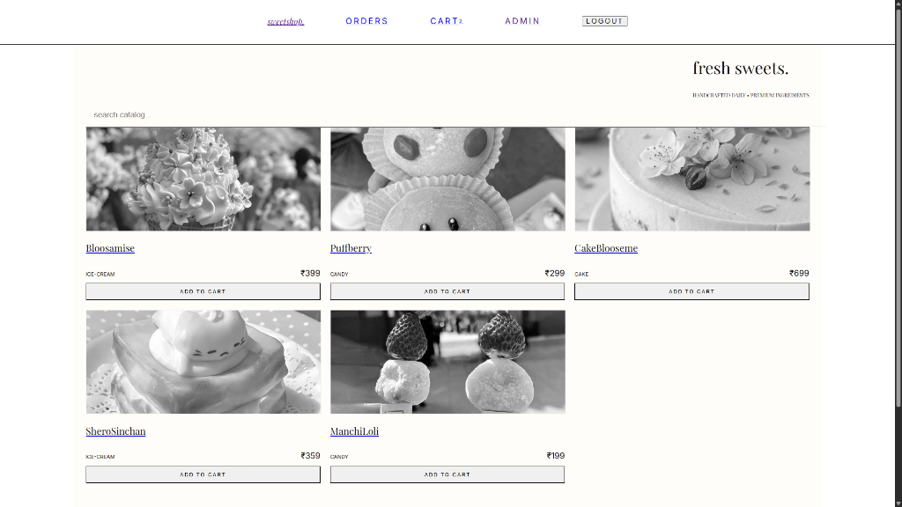
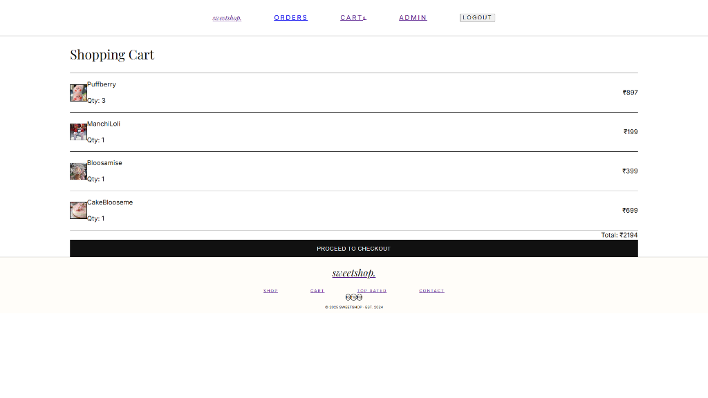
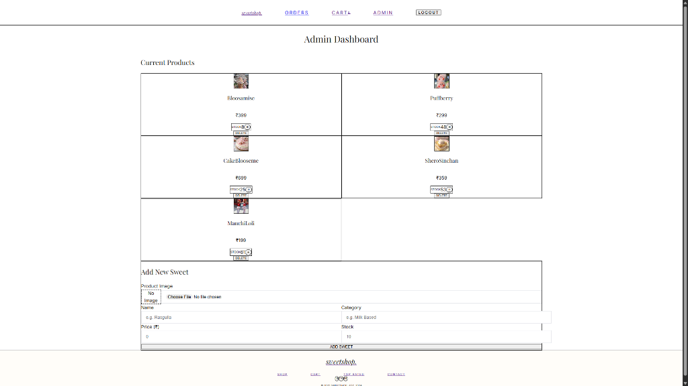
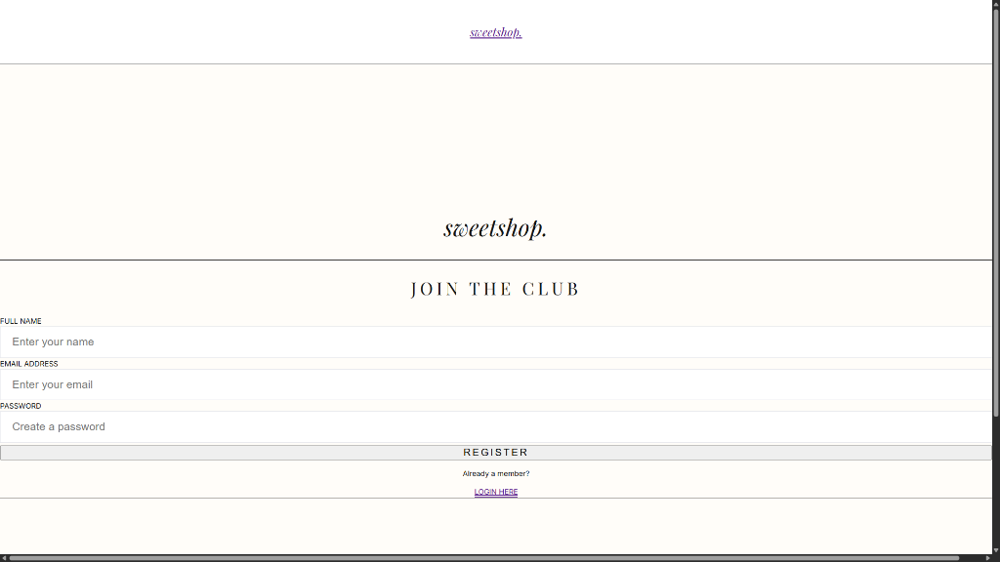
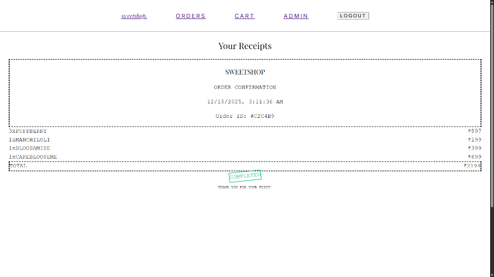

# Sweet Shop 🍬

## Live Demo
- **Storefront**: [https://sweets-sweets-trex.onrender.com](https://sweets-sweets-trex.onrender.com)


### Admin Credentials (Try it!)
- **Email**: `trex@gmail.com`
- **Password**: `pass12345`

## Screenshots

| Home Page | Shopping Cart |
|:---:|:---:|
|  |  |

| Admin Dashboard | Registration |
|:---:|:---:|
|  |  |

| Order Receipt |
|:---:|
|  |

A full-stack e-commerce application for selling sweets. Built with React (Vite) and Express (Node.js).

## Setup Instructions

### Backend
1. Navigate to the `backend` directory:
   ```bash
   cd backend
   ```
2. Install dependencies:
   ```bash
   npm install
   ```
3. Create a `.env` file in the `backend` directory with the following variables:
   ```env
   PORT=5000
   MONGO_URI=your_mongodb_connection_string
   JWT_SECRET=your_jwt_secret
   CLOUDINARY_CLOUD_NAME=your_cloud_name
   CLOUDINARY_API_KEY=your_api_key
   CLOUDINARY_API_SECRET=your_api_secret
   ```
4. Start the server:
   ```bash
   npm start
   ```

### Frontend
1. Navigate to the `frontend` directory:
   ```bash
   cd frontend
   ```
2. Install dependencies:
   ```bash
   npm install
   ```
3. Start the development server:
   ```bash
   npm run dev
   ```

## Testing

### Running Tests
- **Backend**: Run `npm test` in the `backend` directory.
- **Frontend**: Run `npm test` in the `frontend` directory.

## My Development Approach

This project was primarily developed by me as part of my full-stack learning journey.

### Backend Development
- The complete backend (Node.js, Express, MongoDB) was designed and implemented by me.
- Authentication, authorization, role-based access control (admin/user), REST APIs, and database models were written manually.
- Special focus was given to security, ensuring that admin-only routes are properly protected and cannot be accessed by normal users.

### Frontend Development
- The frontend was built using React (Vite).
- Most of the component logic, routing, and API integration was done independently.
- Some minor help from ChatGPT was taken to improve CSS styling and UI aesthetics.

### Testing
- Basic guidance was taken from ChatGPT for setting up backend and frontend tests.
- Test logic and integration were understood and adapted manually as per project needs.

### Reflection
This project helped me strengthen my understanding of full-stack development, especially authentication, authorization, RESTful API design, and role-based access control. Limited AI assistance was used only as a learning aid, not as a replacement for implementation.

## Deployment

### Backend (Render)
1.  **Push to GitHub**: Ensure your code is pushed to your GitHub repository.
2.  **Create Service**: Go to [Render Dashboard](https://dashboard.render.com/).
3.  **Blueprints**: Click "New" -> "Blueprint".
4.  **Connect Repo**: Connect your GitHub repository.
5.  **Apply**: Render will detect `render.yaml` and auto-configure the backend service.
6.  **Environment Variables**: You will be prompted to enter the values for `MONGO_URI`, `JWT_SECRET`, etc.

**Manual Setup (Alternative):**
-   **Build Command**: `npm install`
-   **Start Command**: `npm start`
-   **Root Directory**: `backend`
-   **Environment Variables**: Add all variables from your `.env` file.

### Frontend (Render)
1.  **Push**: Ensure your code (with the updated `render.yaml`) is pushed to GitHub.
2.  **Dashboard**: Go to your Render Dashboard.
3.  **Update Blueprint**:
    -   Render should detect the changes in `render.yaml` automatically.
    -   Go to your "Blueprints" page and click "Sync" or "Update" if it doesn't happen automatically.
    -   It will create a new **Static Site** service for your frontend alongside the backend.
4.  **Done**: Render will build your React app and deploy it!

## Features
- User Authentication (Register/Login)
- Product Management (Admin)
- Shopping Cart
- Order Management
